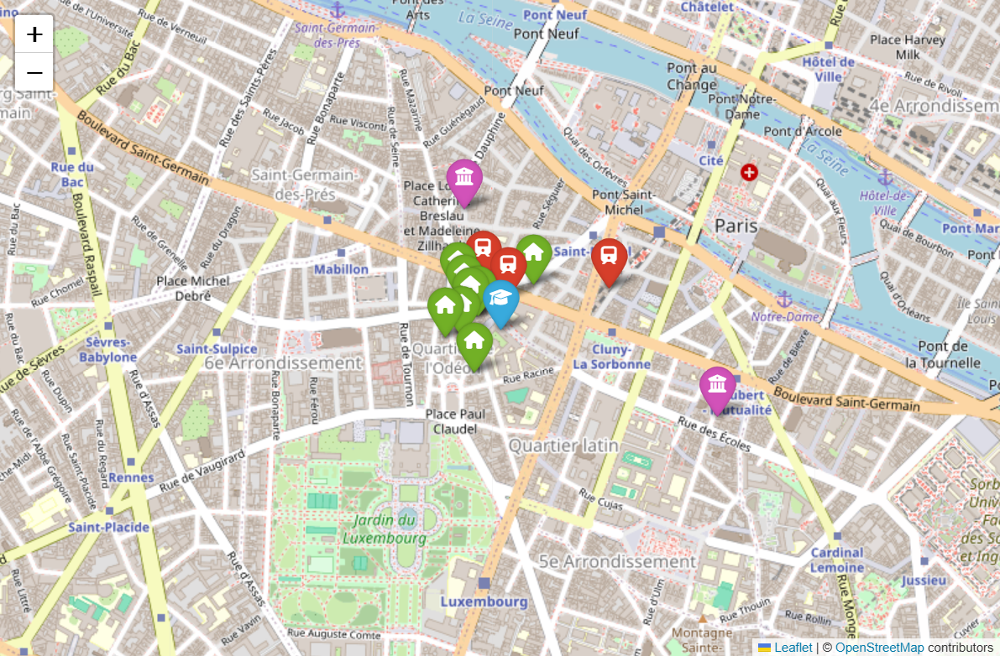
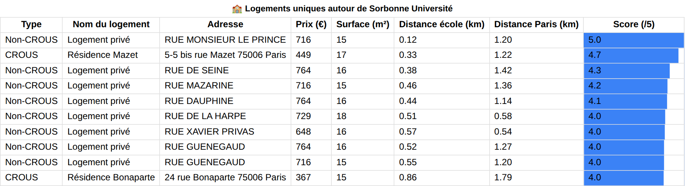
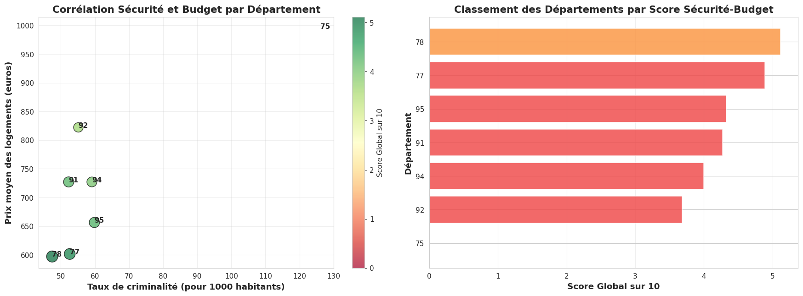
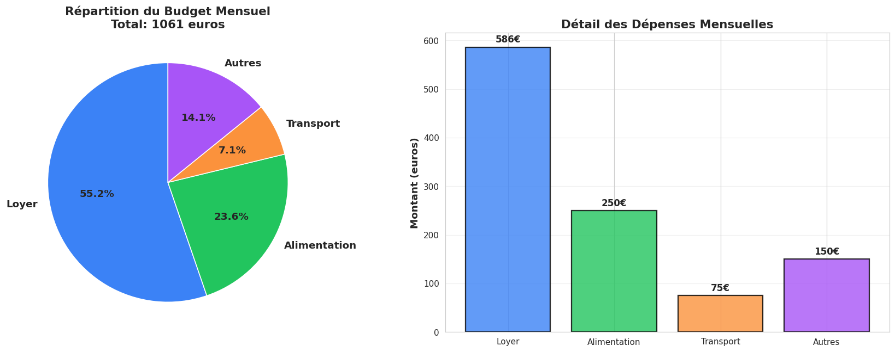
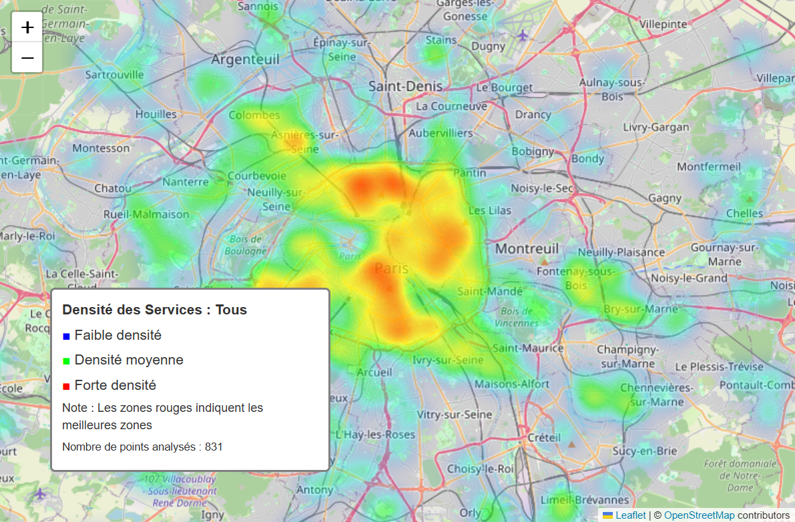

# Data Science — ECE Paris (2025/2026)

## Aide à la recherche de logement étudiant en Île-de-France

Projet de groupe du module **Data Science** du cycle ingénieur de l'ECE Paris (majeure Data & IA).

**Problème :** un étudiant qui cherche un logement en Île-de-France doit croiser son budget, la distance à son école, les transports, la sécurité et la qualité de vie du quartier. Ces informations sont dispersées dans des sources différentes.

**Solution :** un notebook qui croise **8 jeux de données ouverts** et en tire **10 outils interactifs** d'aide à la décision : cartes, recommandation de logements, scores, simulateur de budget.

📓 [`logement_etudiant_idf.ipynb`](logement_etudiant_idf.ipynb)

**▶ Cartes interactives en ligne :** [huggingface.co/spaces/edouardmnt04/logement-etudiant-idf-cartes](https://huggingface.co/spaces/edouardmnt04/logement-etudiant-idf-cartes)

**Stack :** Python · pandas · NumPy · Folium (cartes, heatmap) · ipywidgets · Matplotlib / Seaborn · geopy · pyproj

---

## Données

| Jeu de données | Volume | Utilisation |
|---|---|---|
| Logements privés (loyer estimé au m² de référence) | 43 932 logements | Offre privée, prix, surfaces |
| Résidences CROUS (loyers et types de logements) | 155 résidences | Offre CROUS |
| Établissements d'enseignement supérieur | 62 écoles | Point de départ de chaque recherche |
| Gares d'Île-de-France (coordonnées Lambert 93 converties en GPS) | 1 234 gares | Accessibilité en transport |
| Espaces verts | 11 340 espaces | Qualité de vie |
| Commerces alimentaires et classiques par commune | 7 700 lignes | Services de proximité |
| Taux de criminalité par département (2024) | 8 départements | Sécurité |

## Les 10 outils

| # | Outil | Ce qu'il fait |
|---|---|---|
| 1 | Carte de l'école | Pour une école : les 2 résidences CROUS, les 8 logements privés et les 3 gares les plus proches |
| 2 | Espaces verts | Les 5 espaces verts les plus proches d'un logement |
| 3 | Écoles par secteur | Filtre des écoles par département et par secteur public / privé |
| 4 | **Recommandation** | Top 10 des logements autour d'une école selon le budget, la surface et la distance, avec un score /5 |
| 5 | Commerces | Répartition des types de commerces par commune |
| 6 | Loyers CROUS vs privé | Comparaison des loyers par source, arrondissement, type et surface |
| 7 | Sécurité et coût de la vie | Criminalité croisée avec le loyer moyen par département |
| 8 | **Score d'accessibilité** | Note /10 par école : gares à moins de 1 km (40 %), logements à moins de 3 km (30 %), prix (30 %) |
| 9 | **Simulateur de budget** | Budget mensuel (loyer médian autour de l'école, alimentation, transport, autres) |
| 10 | Carte de densité | Heatmap de la concentration de logements, écoles et espaces verts |

### Aperçus

**Carte d'une école et de son environnement (outil 1)**



**Recommandation de logements (outil 4)** : Sorbonne Université, budget 800 €, surface ≥ 15 m², distance ≤ 3 km



**Sécurité et coût du logement par département (outil 7)**



**Simulateur de budget (outil 9)**



**Densité des services étudiants (outil 10)**



---

## Lancer le projet

```bash
pip install -r requirements.txt
jupyter lab logement_etudiant_idf.ipynb   # puis « Run All »
```

Les widgets et les cartes Folium ne s'affichent pas dans l'aperçu GitHub. Il faut exécuter le notebook dans Jupyter ou Google Colab pour les utiliser. Deux cartes interactives sont aussi exportées dans [`cartes/`](cartes) : télécharger le fichier HTML et l'ouvrir dans un navigateur.

## Auteurs

Projet de groupe : **Clara Chalayer**, **Chloé Lestic** et **Édouard Menut**.

Autres projets d'Édouard : [Machine Learning](https://github.com/Edouardmnt/ECE-Machine-Learning-2025-2026) · [Data Mining](https://github.com/Edouardmnt/ECE-Data-Mining-2025-2026) · [Big Data](https://github.com/Edouardmnt/ECE-Big-Data-2025-2026)
